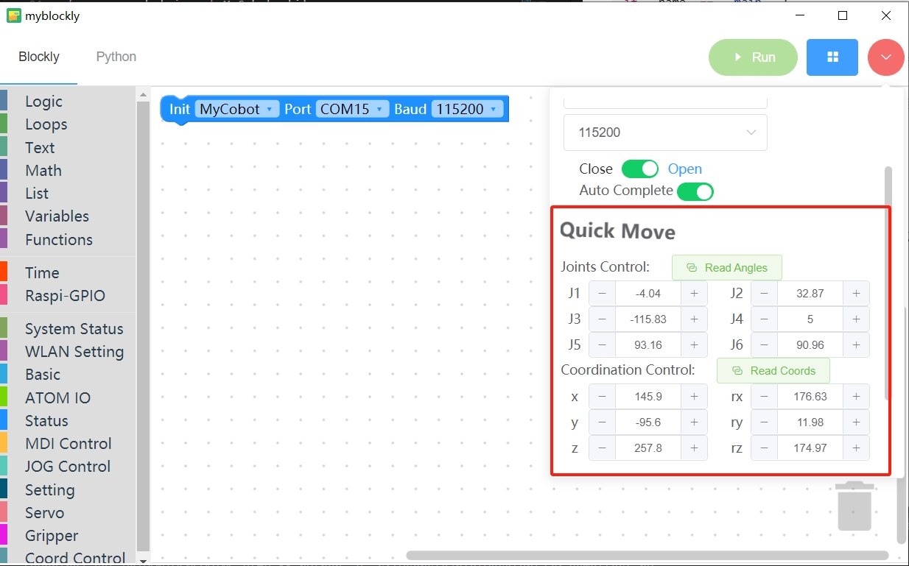

# 机器人夹爪搬运木块案例

## 1 功能说明
机器人会使用夹爪将木块从A点搬运到B点

## 2 硬件安装
先将夹爪的法兰安装到机械臂的末端上


然后将夹爪安装在夹爪的法兰上


然后用夹爪线将夹爪盒机械臂末端IO连接起来，连接时注意先将机械臂断电，避免热插补损坏夹爪。


## 3 夹爪测试
运行下面程序，夹爪会重复2次闭合张开的动作
```python
from pymycobot import MyCobot,PI_PORT,PI_BAUD
import time
arm=MyCobot(PI_PORT,PI_BAUD)

if __name__=="__main__":
    arm.set_gripper_mode(0)#夹爪设置为透传模式
    for i in range(2):
        arm.set_gripper_state(1,100)#夹爪闭合
        time.sleep(1)
        arm.set_gripper_state(0,100)#夹爪张开
        time.sleep(1)
```
## 4 软件使用
利用myblockly的快速移动功能，对木块的抓取点和放置点进行示教，并且记录下位置信息,示教完后，需要断开串口的连接，否则会在运行python脚本时，报串口被占用的错误


## 5 复合应用
```python
from pymycobot import MyCobotPI_PORT,PI_BAUD
import time

init_angles=[-3.25, -2.46, -95.09, 9.22, 86.39, 93.33]#初始位置的6个关节角度
grab_point=[214.5, -189.9, 185.5, -177.5, 1.91, 173.49]#抓取点的坐标
place_point=[214.5, -50.9, 185.5, -177.5, 1.91, 173.49]#放置点的坐标

arm=MyCobot(PI_PORT,PI_BAUD)
if __name__=="__main__":    
    arm.set_gripper_state(0,100)#夹爪先张开  
    time.sleep(1)  
    arm.send_angles(init_angles,100)#运动初始位置
    time.sleep(2)
    arm.send_coords([grab_point[0],grab_point[1],grab_point[2]+70,grab_point[3],grab_point[4],grab_point[5]],100,1)#运动到抓取点上方70mm
    time.sleep(2)
    arm.send_coords([grab_point[0],grab_point[1],grab_point[2],grab_point[3],grab_point[4],grab_point[5]],100,1)#运动到抓取点
    time.sleep(2)
    arm.set_gripper_state(1,100)#夹爪闭合
    time.sleep(1)
    arm.send_coords([grab_point[0],grab_point[1],grab_point[2]+70,grab_point[3],grab_point[4],grab_point[5]],100,1)#运动到抓取点上方70mm
    time.sleep(2)

    arm.send_coords([place_point[0],place_point[1],place_point[2]+70,place_point[3],place_point[4],place_point[5]],100,1)#运动到放置点上方70mm
    time.sleep(2)
    arm.send_coords([place_point[0],place_point[1],place_point[2],place_point[3],place_point[4],place_point[5]],100,1)#运动到放置点
    time.sleep(2)
    arm.set_gripper_state(0,100)#夹爪张开
    time.sleep(1)
    arm.send_coords([place_point[0],place_point[1],place_point[2]+70,place_point[3],place_point[4],place_point[5]],100,1)#运动到放置点上方70mm
    time.sleep(2)
```
## 6 效果展示
