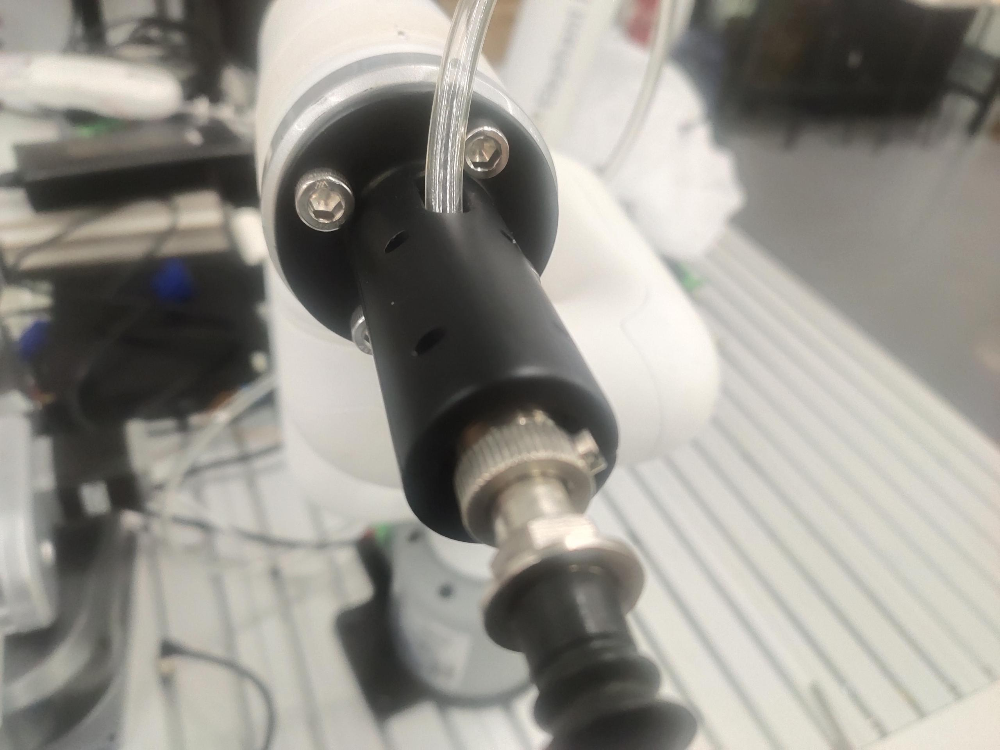

# Robot suction pump to move wood blocks

## 1 Functional description
The robot will use the suction pump to move the wood blocks from point A to point B

## 2 Hardware installation
First install the suction pump on the end of the robot arm


Then connect the wire of the suction pump control box to the base IO of the robot arm


## 3 Suction pump test
Run the following program, the suction pump will repeat the opening and closing action twice
```python
from pymycobot import MyCobot,PI_PORT,PI_BAUD
import time
arm=MyCobot(PI_PORT,PI_BAUD)
for i in range(2):
    arm.set_basic_output(1,0)#OUT1 output open
    time.sleep(2)
    arm.set_basic_output(1,1)#OUT1 output closed
    time.sleep(2)

```
## 4 Software Usage
Use the fast movement function of myblockly to teach the grabbing point and placement point of the wooden block, and record the position information. After teaching, you need to disconnect the serial port, otherwise the serial port will be reported when running the python script.


## 5 Composite Application
```python
from pymycobot import MyCobot,PI_PORT,PI_BAUD
import time

init_angles=[-3.25, -2.46, -95.09, 9.22, 86.39, 93.33]#6 joint angles at the initial position
grab_point=[196.9, -197.1, 124.5, -178.8, 1.25, 173.32]#Coordinates of the grab point
place_point=[196.9, -97.1, 124.5, -178.8, 1.25, 173.32]#Coordinates of the placement point
arm=MyCobot(PI_PORT,PI_BAUD)

if __name__=="__main__":
    arm.set_basic_output(1,1)#Turn off the suction pump first   
    time.sleep(1)   
    arm.send_angles(init_angles,100)#Move to the initial position   
    time.sleep(2)   
    arm.send_coords([grab_point[0],grab_point[1],grab_point[2]+70,grab_point[3],grab_point[4],grab_point[5]],100,1)#Move to 70mm above the grab point    
    time.sleep(2)
    arm.send_coords([grab_point[0],grab_point[1],grab_point[2],grab_point[3],grab_point[4],grab_point[5]],100,1)#Move to the grab point
    time.sleep(2)
    arm.set_basic_output(1,0) #Turn on the suction pump
    time.sleep(1)
    arm.send_coords([grab_point[0],grab_point[1],grab_point[2]+70,grab_point[3],grab_point[4],grab_point[5]],100,1)#Move to 70mm above the grab point
    time.sleep(2)
    
    arm.send_coords([place_point[0],place_point[1],place_point[2]+70,place_point[3],place_point[4],place_point[5]],100,1)#Move to 70mm above the placement point
    time.sleep(2)
    arm.send_coords([place_point[0],place_point[1],place_point[2],place_point[3],place_point[4],place_point[5]],100,1)#Move to the placement point
    time.sleep(2)
    arm.set_basic_output(1,1) #Turn off the suction pump
    time.sleep(1)
    arm.send_coords([place_point[0],place_point[1],place_point[2]+70,place_point[3],place_point[4],place_point[5]],100,1)#Move to 70mm above the placement point
    time.sleep(2)
```
## 6 Effect display

