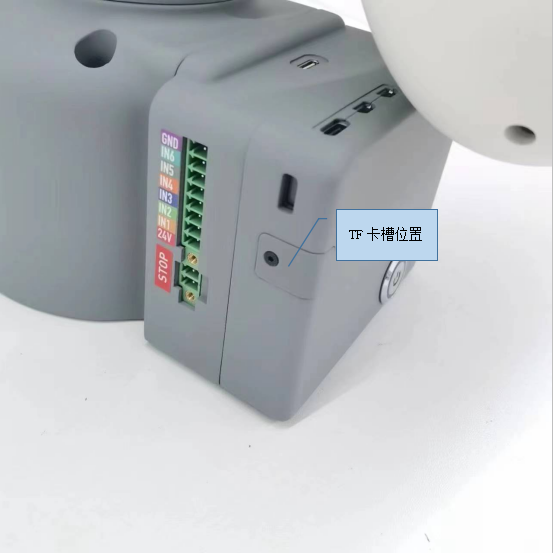
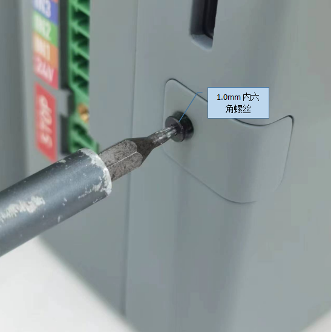
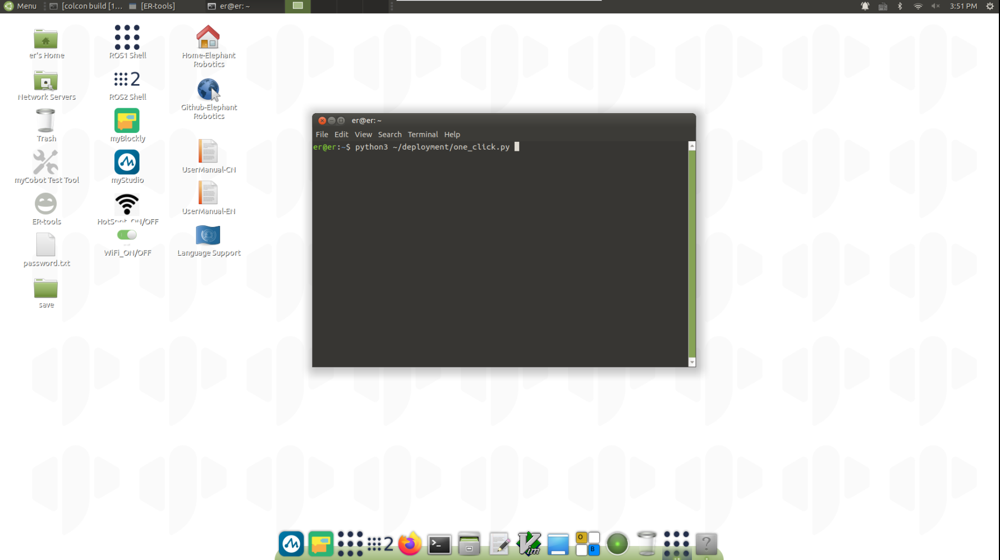
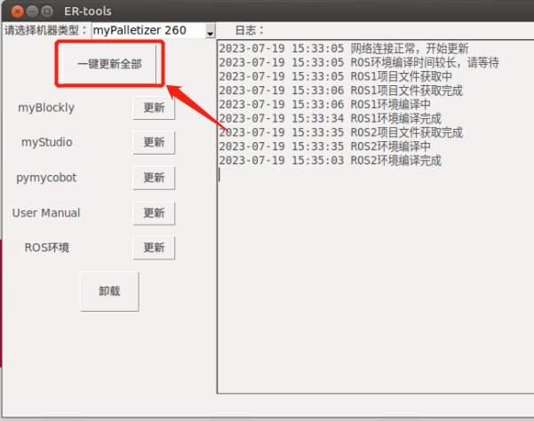
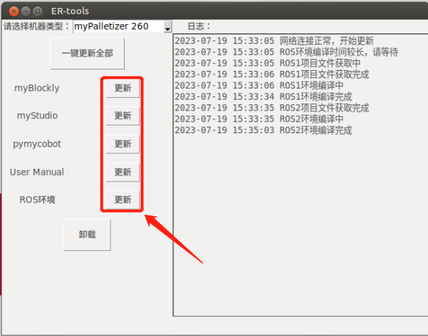

# 镜像下载

- **下载系统镜像文件**

    <table>
    <tr>
        <td>产品</td>
        <td>版本</td>
        <td>链接</td>
        <td>SHA256 Hash</td>
    </tr>

    <tr>
        <td rowspan='2'>myCobot 320 PI</td>
        <td>ubuntu 18.04</td>
        <td><a href="https://download-elephantrobotics.oss-cn-shenzhen.aliyuncs.com/Product_software/iMage-ISO/myCobot-320/myCobot_320_ubuntu_V20220805-2.zip">Download</a></td>
        <td>bc2ed6ef8d51a885f45379392b71e35420638a427d5b4b3a3c9d1803d7e589eb</td>
    </tr>
    <tr>
        <td>ubuntu 20.04</td>
        <td><a href="https://download-elephantrobotics.oss-cn-shenzhen.aliyuncs.com/Product_software/iMage-ISO/myCobot-320/myCobot_320_ubuntu_V20221101_20.04Pi_aarch64-shrink.zip">Download</a></td>
        <td>c95633bfd49246254f2be4783c6a91a15212422219157962c93125092aff6b34</td>
    </tr>

    </table>

## 镜像烧录

### TF 卡拆卸流程

设备底座正面展示图

- 第一步：查看确认 TF 卡槽位置
  

- 第二步：使用内六角螺丝刀，取出螺丝
  

- 第三步：取下 TF 卡保护盖板
  

- 第四步：取出 TF 卡，或更换 TF 卡。（注意需要断电操作）
  
  

### 烧录工具

- **什么是镜像**

  - 镜像是一种文件保存方式。它指的是保存在一张光盘中的数据在另一张光盘中同样存在，不会有任何变形。镜像文件通常保存为 BIN、IMG、TAO、DAO、FCD。它类似于 ZIP 包，按照一定的格式将一系列文件合并成一个文件，以满足用户的需求。镜像的最基本功能是可以通过软件立即识别并记录到光盘上。一般来说，镜像文件可以扩展到更多信息，如系统文件。因此，镜像文件甚至可以包含硬件信息。创建镜像文件最典型的软件是 Ghost，它具有将信息保存到光盘上的记录功能。

- **如何更新系统**

  **Step 1:** 解压软件包后，会出现一个图像样式文件。

  

  **Step 2:** 下载 Win32DiskImager。

  请访问 [Win32DiskImager](https://sourceforge.net/projects/win32diskimager/) 下载。

  

  **Step 3:** 从基座上取下 TF 卡，然后将 TF 卡插入电脑。

  <!--  -->

  **Step 4:** 打开 Win32DiskImager。

  

  **Step 5:** 选择软件和设备（E 盘），然后将软件写入 PC。

  

  

  **Step 6:** 已成功处理。

  

- **根据机器人配置系统**

  - 按快捷键<kbd>Ctrl</kbd>+<kbd>Alt</kbd>+<kbd>T</kbd>打开终端，输入`python3 ~/deployment/one_click.py`打开 ER-tools

    

  - 选择相应的机器人型号，点击 **一键更新全部**，等待完成

    **注意：更新 pymycobot 和 ros1、ros2 时，更新会因网络不稳定而失败，建议分开更新**

    

    

  - 如果不需要更新所有软件，请单击相应的软件按钮

    

---

[← 上一页](8.3_softwareSource.md) | [下一页 →](8.5_PublicityMaterial.md)
