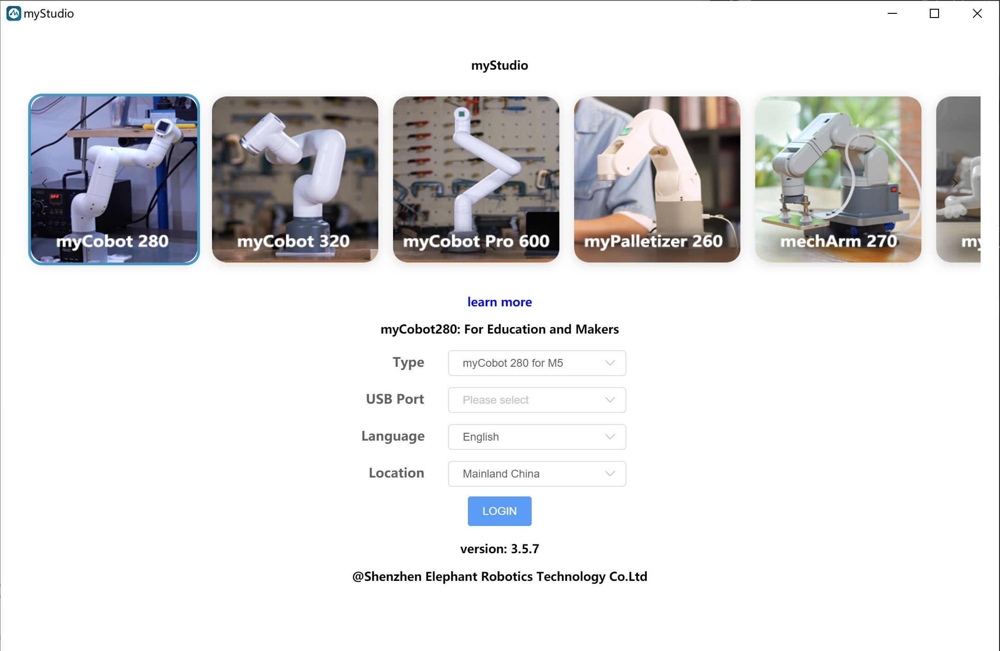

# System Firmware

## 1 Reasons for Designing myStudio

- Because myStudio is a one-step application platform for a variety of robots.

- Because it is easy for users to select corresponding firmwares to meet demands and acquire related tutorial data online.

## 2 Latest Version and Supported Systems

- Version 3.4.1(updated on Oct 1, 2022)

- Supported Systems: Windows, Mac and Linux

## 3 Functions

- Burning and updating firmwares

- Providing tutorial data, such as user manuals and tutorial video

- Providing information about maintenance and repair

## 5 Recommended Firmwares

The optimal firmwares varies with the type of robots in use. Recommended firmwares for different types of robots are listed as follows.

**myCobot 320（2022） series**

myCobot 320（2022） series have two versions: M5 and PI. With different core for signal connection, different firmwares are required to be burnt.

<table>
<tr>
	<td>Robot Version</td>
    <td>Core</td>
    <td>Firmware to be Burnt</td>
    <td>Recommened Firmware</td>
</tr>
<tr>
	<td rowspan='3'>M5</td>
    <td>M5Stack-basic</td>
    <td>miniRobot</td>
    <td>v2.0 is recommended</td>
</tr>
<tr>
	<td>Atom</td>
    <td>atomMain</td>
    <td>v5.0 is recommended</td>
</tr>
<tr>
	<td>Pico</td>
    <td>picoMain</td>
    <td>v1.0 is recommended</td>
</tr>
<tr>
	<td rowspan='3'>PI</td>
    <td>RaspberryPI 4B</td>
    <td>ubuntu</td>
    <td>v18.04. is recommended</td>
</tr>
<tr>
	<td>Atom</td>
    <td>atomMain</td>
    <td>v5.0 is recommended</td>
</tr>
<tr>
	<td>Pico</td>
    <td>picoMain</td>
    <td>v1.0 is recommended</td>
</tr>
</table>

**myCobot 320（2020）series**

<table>
<tr>
	<td>Robot Version</td>
    <td>Core</td>
    <td>Firmware to be Burnt</td>
    <td>Recommened Firmware</td>
</tr>
<tr>
	<td rowspan='2'>M5</td>
    <td>M5Stack-basic</td>
    <td>miniRobot</td>
    <td>v1.0 is recommended</td>
</tr>
<tr>
	<td>Atom</td>
    <td>atomMain</td>
    <td>v4.2 is recommended</td>
</tr>
<tr>
	<td rowspan='2'>PI</td>
    <td>RaspberryPI 4B</td>
    <td>ubuntu</td>
    <td>v18.04. is recommended</td>
</tr>
<tr>
	<td>Atom</td>
    <td>atomMain</td>
    <td>v4.2 is recommended</td>
</tr>
</table>
