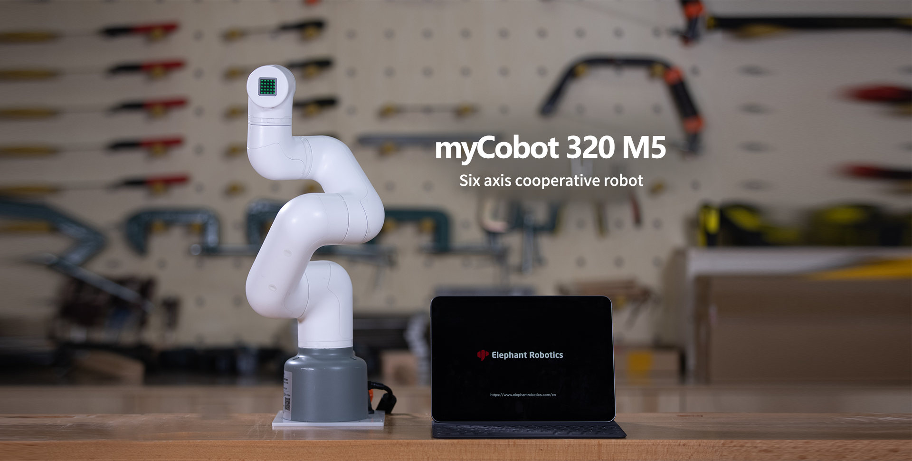

# 宣传资料

## 产品画册

|      机器      |                                                                                                产品画册                                                                                                |
| :------------: | :----------------------------------------------------------------------------------------------------------------------------------------------------------------------------------------------------: |
| myCobot 320 M5 | [download](https://download-elephantrobotics.oss-cn-shenzhen.aliyuncs.com/Product_software/myCobot/%E4%BA%A7%E5%93%81%E7%94%BB%E5%86%8C/%E4%BA%A7%E5%93%81%E7%94%BB%E5%86%8Cmycobot320m5v20221013.pdf) |

## 产品视频

### 宣传视频

<video id="my-video" class="video-js" controls preload="auto" width="100%"
poster="" data-setup='{"aspectRatio":"16:9"}'>

<source src="https://www.elephantrobotics.com/wp-content/uploads/2022/04/0427-320-%E6%9C%BA%E6%A2%B0%E8%87%82-%E4%B8%AD%E6%96%87%E7%89%88.m4v"></video>

### 开箱视频

<video id="my-video" class="video-js" controls preload="auto" width="100%"
poster="" data-setup='{"aspectRatio":"16:9"}'>

<source src="https://static.elephantrobotics.com/wp-content/uploads/2022/04/%E4%B8%AD%E6%96%87%E6%94%B92.mp4"></video>

### 案例视频

#### python

- 控制 RGB 灯板
<video id="my-video" class="video-js" controls preload="auto" width="100%"
poster="" data-setup='{"aspectRatio":"16:9"}'>

  <source src="../../resources/10-ApplicationPython/myArm/2.1python控制RGB灯板01.mp4"></video>

---

- 控制机械臂回原点
<video id="my-video" class="video-js" controls preload="auto" width="100%"
poster="" data-setup='{"aspectRatio":"16:9"}'>

  <source src="../../resources/10-ApplicationPython/myArm/2.2python控制机械回原点01.mp4"></video>

---

- 单关节运动
<video id="my-video" class="video-js" controls preload="auto" width="100%"
poster="" data-setup='{"aspectRatio":"16:9"}'>

  <source src="../../resources/10-ApplicationPython/myArm/2.3控制单关节运动01.mp4"></video>

---

- 多关节运动
<video id="my-video" class="video-js" controls preload="auto" width="100%"
poster="" data-setup='{"aspectRatio":"16:9"}'>

  <source src="../../resources/10-ApplicationPython/myArm/2.4控制多个关节01.mp4"></video>

---

- 控制机械臂左右摆动
<video id="my-video" class="video-js" controls preload="auto" width="100%"
poster="" data-setup='{"aspectRatio":"16:9"}'>

  <source src="../../resources/10-ApplicationPython/myArm/2.5python控制机械臂左右摆动01.mp4"></video>

---

- 控制机械臂跳舞
<video id="my-video" class="video-js" controls preload="auto" width="100%"
poster="" data-setup='{"aspectRatio":"16:9"}'>

  <source src="../../resources/10-ApplicationPython/myArm/2.6控制机械臂跳舞01.mp4"></video>

---

- 夹爪控制
<video id="my-video" class="video-js" controls preload="auto" width="100%"
poster="" data-setup='{"aspectRatio":"16:9"}'>

  <source src="../../resources/10-ApplicationPython/myArm/2.7夹爪的安装与使用01.mp4"></video>

## 产品图片

---

[← 上一页](8.4_systemInfo.md) | [下一章 →](../../9-AboutUs/README.md)
