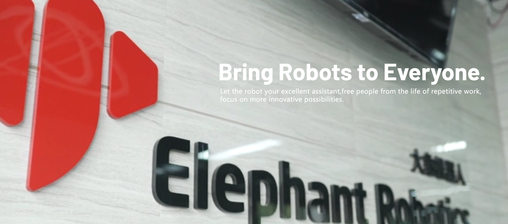
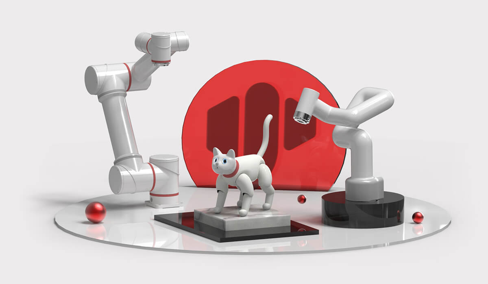

# Elephant Robotics

### 1 Company Introduction

Elephant Robotics is based in Shenzhen, China, a high-tech company which focuses on the design, research and development of robots and automation solutions.

We are devoted to providing highly flexible robots, easy-to-learn operating systems and intelligent automation solutions for robot education, scientific research institutions, business situations and industrial production. Our product quality and intelligent solutions have obtained unanimous acceptance and favorable comments from a number of world top 500 enterprises & factories in South Korea, Japan, America,Germany, Italy, Greece, etc.

Abiding by the vision of "enjoy robots world, Elephant Robotics initiates collaborative work between human and robots to make robots be good life and work helpers for human so as to free people from simple,repeated and dull jobs and give full play to the advantages of human-robot coordination, thus improving work efficiency and helping human to create a nice, new life.

In the future, Elephant Robotics hopes to promote the development of the robot industry through a new generation of cutting-edge technology, and
starts a new era of automation and intelligence with its customers hand in hand.

***

### 2 Development History

In August 2016, Elephant Robotics was established.

In August 2016, entered HAX Incubator and obtained SOSV seed round
investment.

In July 2017, the two founders were included in Forbes Asia\'s "30
Business Elites under Age 30".

In October 2017, published the fifth generation of single-arm industrial
cobot called Elephant S.

In April 2018, obtained angel round investment from Cloud Angel Fund.

In June 2018, was awarded "Intelligent Manufacture Entrepreneurship MBA
Award" by CKGSB.

In June 2018, was awarded "Startup Accelerator X-elerator Award"
operated by Tsinghua University.

In November 2018, won the second place in the Asian Smart Hardware
Competition in Shenzhen Division

In November 2018, obtained the \"Most Invested Company Award\" in
GaogongGold Globe Award.

In March 2019, obtained the \"Leading Person Award \" in Gaogong Gold
Globe Award.

In April 2019, obtained Catbot "Industrial Robot Innovation Award".

In September 2019, attended Huawei European Eco-Conference (HCE) and
became a member of Huawei eco-partners.

In November 2019, Elephant Robotics attended the IROS International
Conference on Intelligent Robots and Systems jointly with Harbin
Institute of Technology.

In December 2019, obtained "Gaogong 2019 Innovation Technology Award".

In December 2019, was awarded as one of the Gaogong 2019 Top 10 Fast
Growing Enterprises.

In December 2019, was awarded the \"Emerging Enterprise Award" in the
industrial robotics segment field of Shenzhen equipment industry.

In December 2019, launched the fist type of bionic robotic cat called
MarsCat in the world.

In May 2020, the founders obtained \"Shenzhen Robot Emerging Talent
Award" in 2019.

In October 2020, launched the smallest six-axis cobot named myCobot in
the world.

In March 2020, launched the smallest cobot named myCobotPro 320 for
scientific research in the world.

In May 2021, the Mars bionic cat named MarsCat was reported by several
media such as Xinhua Finance, China Daily, Nanjing Daily, Harbin Daily,
etc.

In July 2021, published the seat for the smallest hybrid robot, a baby
elephant moving robot called myAGV.

In September 2021, launched the world's first type of fully wrapped
four-axis robot arm, a tiny elephant palletizing robot arm called
myPalletizer.

### 3 Related Links
-   Official website: https://www.elephantrobotics.com
-   Purchase link
	* shopify：https://shop.elephantrobotics.com/
-   Video
	* bilibili：https://space.bilibili.com/2126215657

	* youtube：https://www.youtube.com/c/Elephantrobotics

[← Previous Page](./README.md)| [Next Page →](./9.2_contact.md)