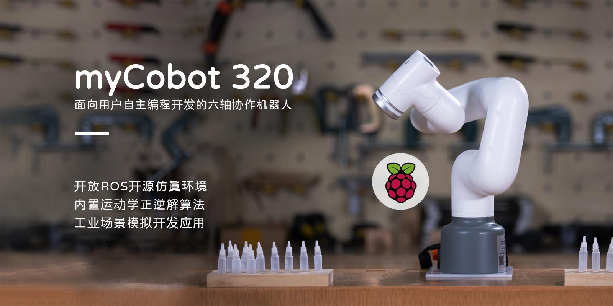

# myCobot 320

> Six-axis collaborative robots for user-developed autonomous programming

## English

### gitbook-en

- M5 version:
  https://docs.elephantrobotics.com/docs/mycobot-320-m5-en/
- Pi version:
  https://docs.elephantrobotics.com/docs/mycobot-320-pi-en/

### gitbook-cn

- M5 version:
  https://docs.elephantrobotics.com/docs/mycobot-320-m5-cn/
- Pi version:
  https://docs.elephantrobotics.com/docs/mycobot-320-pi-cn/

### Product Diagram

- M5：  
  [Product Catalogue](https://download-elephantrobotics.oss-cn-shenzhen.aliyuncs.com/Product_software/myCobot/%E4%BA%A7%E5%93%81%E7%94%BB%E5%86%8C/%E4%BA%A7%E5%93%81%E7%94%BB%E5%86%8Cmycobot320m5v20221013.pdf)
  

- Pi：  
  [Product Catalogue](https://download-elephantrobotics.oss-cn-shenzhen.aliyuncs.com/Product_software/myCobot/%E4%BA%A7%E5%93%81%E7%94%BB%E5%86%8C/%E4%BA%A7%E5%93%81%E7%94%BB%E5%86%8CmyCobot320pi20221013.pdf)
  

### Product Introduction

Developed by Elephant Robotics, the myCobot 320 Robotic Arm is a collaborative robot designed for education, research and light industrial automation. Renowned for its compact design and powerful features, this robot is dedicated to providing endless possibilities for innovation and learning. It has a maximum arm span of 350 mm, a maximum payload of 1 kg, and supports programming languages of varying difficulty, making it suitable for users of all skill levels.  
The arm supports Python and has hardware interfaces such as IO and USB, making it easy to connect to a variety of sensors and actuators. It also provides rich open source libraries and APIs to simplify the development process, and is compatible with Windows, Linux, and MacOS, making it suitable for a variety of development environments and encouraging users to participate in extended development.

### catalogue

- M5：

- [1 Product Introduction](1-ProductIntroduction/README.md)

  - [1.1 Design Philosophy](1-ProductIntroduction/1.1-DesignPhilosophy.md)
  - [1.2 Suitable Users](1-ProductIntroduction/1.2-SuitableUsers.md)
  - [1.3 Application Scenario](1-ProductIntroduction/1.3-ApplicationScenario.md)
  - [1.4 Accessories Tools](1-ProductIntroduction/1.4-AccessoriesTools/1.4-AccessoriesTools.md)
    - [1.4.1 AdaptiveGripper](1-ProductIntroduction/1.4-AccessoriesTools/1.4.1-Gripper/1-AdaptiveGripper.md)
    - [1.4.2 ElectricGripper](1-ProductIntroduction/1.4-AccessoriesTools/1.4.1-Gripper/2-ElectricGripper.md)
    - [1.4.3 PneumaticGripper](1-ProductIntroduction/1.4-AccessoriesTools/1.4.1-Gripper/3-PneumaticGripper.md)
    - [1.4.4 FlexibleGripper](1-ProductIntroduction/1.4-AccessoriesTools/1.4.1-Gripper/4-FlexibleGripper.md)
    - [1.4.5 ModulSuctionCup](1-ProductIntroduction/1.4-AccessoriesTools/1.4.2-PumpCup/1-ModuleSuctionCup.md)
    - [1.4.6 CameraModulePro](1-ProductIntroduction/1.4-AccessoriesTools/1.4.3-Camera/1-CameraModulePro.md)
    - [1.4.7 PenHolderPro](1-ProductIntroduction/1.4-AccessoriesTools/1.4.4-Other/1-PenHolderPro.md)
    - [1.4.8 PhoneHolderPro](1-ProductIntroduction/1.4-AccessoriesTools/1.4.4-Other/2-PhoneHolderPro.md)

- [2 Product Feature](2-ProductFeature/2.1_320_M5_product/README.md)

  - [2.1 Functional Parameters](2-ProductFeature/2.1_320_M5_product/2.1.1-MachineSpecification.md)
  - [2.2 Controller Parameters](2-ProductFeature/2.1_320_M5_product/2.1.2-ControlCoreParameter.md)
  - [2.3 Structural Parameters](2-ProductFeature/2.1_320_M5_product/2.1.3-MechanicalStructureParameter.md)
  - [2.4 Electronic Parameters](2-ProductFeature/2.1_320_M5_product/2.1.4-ElectricalCharacteristicParameter.md)
  - [2.5 Coordinate System](2-ProductFeature/2.1_320_M5_product/2.1.5-CoordinateSystem.md)

- [3 User Notes](3-UserNotes/320_M5/REMADE.md)  

  - [3.1 Safety Instructions](3-UserNotes/320_M5/3.1.1-SafetyInstruction/1-SafetyInstruction.md)
  - [3.2 Transport and Storage](3-UserNotes/320_M5/3.1.2-TransportandStorage/1-TransportandStorage.md)
  - [3.3 Maintenance and Care](/3-UserNotes/320_M5/3.1.3-MaintenanceandCare/1-MaintenanceandCare.md)
  - [3.4 FAQs](3-UserNotes/320_M5/4-FAQ/3.2_320_M5_userNotes.md)
    - [3.4.1 how to ask](3-UserNotes/320_M5/4-FAQ/0_how_to_ask.md)
    - [3.4.2 driver](3-UserNotes/320_M5/4-FAQ/1_driver.md)
    - [3.4.3 software](3-UserNotes/320_M5/4-FAQ/2_software.md)
    - [3.4.4 hardware](3-UserNotes/320_M5/4-FAQ/3_hardware.md)

- [4 First Install and Use](4-FirstInstallAndUse/4.2-M5/4.2_320_M5_firstUse.md)

  - [4.1 Product Standard List](4-FirstInstallAndUse/4.2-M5/4.2.1-List.md)
  - [4.2 Product Unboxing Guide](4-FirstInstallAndUse/4.2-M5/4.2.2-UNbox.md)
  - [4.3 Power-on Test Guide](4-FirstInstallAndUse/4.2-M5/4.2.3-StartRobot.md)

- [5 Basic Application](5-BasicApplication/README.md)

  - [5.1 miniRoboflow](/5-BasicApplication/5.1-SystemUsageInstructions/320m5/README.md)  
    - [1 Drag & Play](/5-BasicApplication/5.1-SystemUsageInstructions/320m5/4.2.1.1-micro_controller.md)  
    - [2 Joint Calibration](/5-BasicApplication/5.1-SystemUsageInstructions/320m5/4.2.2.1-micro_controller.md)  
    - [3 Computer Connect](/5-BasicApplication/5.1-SystemUsageInstructions/320m5/4.2.3.1-micro_controller.md)  
    - [4 Robot Information](/5-BasicApplication/5.1-SystemUsageInstructions/320m5/4.2.4.1-micro_controller.md)  
  - [5.2 Firmware Description](5-BasicApplication/5.3-FirmwareUse/m5/1-firmware.md)
    - [1 Burn Firmware](5-BasicApplication/5.3-FirmwareUse/m5/2-burn_firmware.md)
  - [5.3 Application Use](5-BasicApplication/README.md#software-description)
    - [1 myblockly](5-BasicApplication/5.2-ApplicationUse/5.2.1-myblockly/320m5/README.md)
      - [1 FirstUse](5-BasicApplication/5.2-ApplicationUse/5.2.1-myblockly/320m5/1-myBlocklyFirstUse.md)
      - [2 install_uninstall](5-BasicApplication/5.2-ApplicationUse/5.2.1-myblockly/320m5/2-install_uninstall.md)
      - [3 Interface Description](5-BasicApplication/5.2-ApplicationUse/5.2.1-myblockly/320m5/3-interface_description.md)
      - [4 Control RGB](5-BasicApplication/5.2-ApplicationUse/5.2.1-myblockly/320m5/4-ControlRGB.md)
      - [5 Control Robotic Arm Back](5-BasicApplication/5.2-ApplicationUse/5.2.1-myblockly/320m5/5-ControlRoboticArmBackZero.md)
      - [6 Control Single Joint](5-BasicApplication/5.2-ApplicationUse/5.2.1-myblockly/320m5/6-ControlSingleJoint.md)
      - [7 Control Singles Joint](5-BasicApplication/5.2-ApplicationUse/5.2.1-myblockly/320m5/7-ControlSinglesJoint.md)
      - [8 Gripper Use](5-BasicApplication/5.2-ApplicationUse/5.2.1-myblockly/320m5/8-GripperUse.md)
      - [9 API](5-BasicApplication/5.2-ApplicationUse/5.2.1-myblockly/320m5/9-api.md)
      - [10 Q&A](5-BasicApplication/5.2-ApplicationUse/5.2.1-myblockly/320m5/10-Q&A.md)
    - [2 myStudio](5-BasicApplication/5.2-ApplicationUse/5.2.2-mystudio/320m5/README.md)
      - [1 setup](5-BasicApplication/5.2-ApplicationUse/5.2.2-mystudio/320m5/1-setup.md)
      - [2 install](5-BasicApplication/5.2-ApplicationUse/5.2.2-mystudio/320m5/2-install_driver.md)
      - [3 flash](5-BasicApplication/5.2-ApplicationUse/5.2.2-mystudio/320m5//3-flash_firmwares.md)
      - [4 other function](5-BasicApplication/5.2-ApplicationUse/5.2.2-mystudio/320m5/4-other_function.md)

- [6 SDK Development](6-SDKDevelopment/README.md)

  - [6.1 Python](10-ApplicationBasePython/README.md)
    - [1 Environment Building](10-ApplicationBasePython/10.1_320_PI-ApplicationPython/1_download.md)
    - [2 Introduction to API](10-ApplicationBasePython/10.1_320_PI-ApplicationPython/2_API.md)
    - [3 TCP/IP Control](10-ApplicationBasePython/10.1_320_PI-ApplicationPython/3_TCPIP.md)
    - [4 Drag to teach](10-ApplicationBasePython/10.2_320_M5-ApplicationPython/4_drag.md)
    - [5 Handle Control](10-ApplicationBasePython/10.1_320_PI-ApplicationPython/5_Handle_control.md)
    - [6 Videos and Codes for Display](10-ApplicationBasePython/10.2_320_M5-ApplicationPython/6_example.md)
  - [6.2 Robot Operating System 1 (ROS1) ](11-ApplicationBaseROS/11.1-ROS1/11.1.1-M5.md)
    - [1 Environment Building](11-ApplicationBaseROS/11.1-ROS1/11.1.1-320M5/11.1.1.1-环境搭建.md)
    - [2 ROS basics](11-ApplicationBaseROS/11.1-ROS1/11.1.1-320M5/11.1.1.2-ROS基础.md)
    - [3 Rviz use](11-ApplicationBaseROS/11.1-ROS1/11.1.1-320M5/11.1.1.3-rviz介绍.md)
    - [4 Basic function case](11-ApplicationBaseROS/11.1-ROS1/11.1.1-320M5/11.1.1.4-基础功能.md)
  - [6.3 Robot Operating System 2 (ROS2)](11-ApplicationBaseROS/11.2-ROS2/11.2.1-M5.md)
    - [1 Environment Building](11-ApplicationBaseROS/11.2-ROS2/11.2.1-320M5/11.2.1.1-环境搭建.md)
    - [2 ROS2 basics](11-ApplicationBaseROS/11.2-ROS2/11.2.1-320M5/11.2.1.2-ROS2基础.md)
    - [3 Rviz2 use](11-ApplicationBaseROS/11.2-ROS2/11.2.1-320M5/11.2.1.3-rviz2介绍.md)
    - [4 Basic function case](11-ApplicationBaseROS/11.2-ROS2/11.2.1-320M5/11.2.1.4-基础功能.md)
  - [6.4 C Sharp (C#)](15-ApplicationBaseCSharp/15.6C-M5.md)
    - [1 Environmental construction](15-ApplicationBaseCSharp/15.1-myCobot320-M5.md)
    - [2 Mechanical control](15-ApplicationBaseCSharp/15.1.1-angle.md)
    - [3 myCobot API](15-ApplicationBaseCSharp/15.4-API.md)
    - [4 Use Cases](15-ApplicationBaseCSharp/15.5-case.md)
  - [6.5 C plus plus (C++)](12-ApplicationBaseCPlus/README.md)
    - [1 CPlus Download](12-ApplicationBaseCPlus/12.1-download.md)
    - [2 build](12-ApplicationBaseCPlus/12.2-build.md)
    - [3 API](12-ApplicationBaseCPlus/12.3-API.md)
    - [4 example](12-ApplicationBaseCPlus/12.4-example.md)
  - [6.6 Arduino](16-ArduinoEnv320/README.md)
    - [1 arduino Download](16-ArduinoEnv320/16.1-arduino_download.md)
    - [2 API](16-ArduinoEnv320/16.2-api.md)
    - [3 example](16-ArduinoEnv320/16.3-example.md)
  - [6.7 Communication Message Protocol](/6-SDKDevelopment/6.1-CommunicationDoc.md)

- [7 Examples of Robots Using](7-ExamplesRobotsUsing/7.2_320_M5_Examples.md)

- [8 Documents Download](8-FilesDownload/README.md)

  - [8.1 Gitbook Download](https://www.elephantrobotics.com/)
  - [8.2 Product Brochure](8-FilesDownload/8.2_320_M5_Files/8.2_productBrochure.md)
  - [8.3 Software and Source Code](8-FilesDownload/8.2_320_M5_Files/8.3_softwareSource.md)
  - [8.4 System Information](8-FilesDownload/8.2_320_M5_Files/8.4_systemInfo.md)
  - [8.5 Publicity Material](/8-FilesDownload/8.2_320_M5_Files/8.5_PublicityMaterial.md)

- [9 About Us](9-AboutUs/README.md)

  - [9.1 Elephant Robotics](9-AboutUs/9.1_company.md)
  - [9.2 Contact us](9-AboutUs/9.2_contact.md)

- Pi：
- [1 Product Introduction](1-ProductIntroduction/README.md)
  - [1.1 Design Philosophy](1-ProductIntroduction/1.1-DesignPhilosophy.md)
  - [1.2 Suitable Users](1-ProductIntroduction/1.2-SuitableUsers.md)
  - [1.3 Application Scenario](1-ProductIntroduction/1.3-ApplicationScenario.md)
  - [1.4 Accessories Tools](1-ProductIntroduction/1.4-AccessoriesTools/1.4-AccessoriesTools.md)
    - [1.4.1 AdaptiveGripper](1-ProductIntroduction/1.4-AccessoriesTools/1.4.1-Gripper/1-AdaptiveGripper.md)
    - [1.4.2 ElectricGripper](1-ProductIntroduction/1.4-AccessoriesTools/1.4.1-Gripper/2-ElectricGripper.md)
    - [1.4.3 PneumaticGripper](1-ProductIntroduction/1.4-AccessoriesTools/1.4.1-Gripper/3-PneumaticGripper.md)
    - [1.4.4 FlexibleGripper](1-ProductIntroduction/1.4-AccessoriesTools/1.4.1-Gripper/4-FlexibleGripper.md)
    - [1.4.5 ModulSuctionCup](1-ProductIntroduction/1.4-AccessoriesTools/1.4.2-PumpCup/1-ModuleSuctionCup.md)
    - [1.4.6 CameraModulePro](1-ProductIntroduction/1.4-AccessoriesTools/1.4.3-Camera/1-CameraModulePro.md)
    - [1.4.7 PenHolderPro](1-ProductIntroduction/1.4-AccessoriesTools/1.4.4-Other/1-PenHolderPro.md)
    - [1.4.8 PhoneHolderPro](1-ProductIntroduction/1.4-AccessoriesTools/1.4.4-Other/2-PhoneHolderPro.md)
- [2 Product Feature](2-ProductFeature/2.2_320_PI_product/README.md)
  - [2.1 MachineSpecification](2-ProductFeature/2.2_320_PI_product/2.2.1-MachineSpecification.md)
  - [2.2 ControlCoreParameter](2-ProductFeature/2.2_320_PI_product/2.2.2-ControlCoreParameter.md)
  - [2.3 MechanicalStructureParameter](2-ProductFeature/2.2_320_PI_product/2.2.3-MechanicalStructureParameter.md)
  - [2.4 ElectricalCharacteristicParameter](2-ProductFeature/2.2_320_PI_product/2.2.4-ElectricalCharacteristicParameter.md)
  - [2.5 CoordinateSystem](2-ProductFeature/2.2_320_PI_product/2.2.5-CoordinateSystem.md)
- [3 User Notes](3-UserNotes/320_PI/README.md)
- [4 First Install and Use](4-FirstInstallAndUse/4.1-PI/4.1_320_PI_firstUse.md)

  - [4.1 Product Standard List](4-FirstInstallAndUse/4.1-PI/4.1.1-产品清单.md)
  - [4.2 Product Unboxing Guide](4-FirstInstallAndUse/4.1-PI/4.1.2-产品开箱.md)
  - [4.3 Power-on Test Guide](4-FirstInstallAndUse/4.1-PI/4.1.3-开机检测.md)

- [5 Basic Application](5-BasicApplication/README.md)
  - [5.1 System instruction manual](5-BasicApplication/5.1-SystemUsageInstructions/320pi/5.1-SystemUsageInstructions.md)
  - [5.2 FirmwareUse](5-BasicApplication/5.3-FirmwareUse/pi/1-firmware.md)
    - [1 Burn firmware](5-BasicApplication/5.3-FirmwareUse/pi/2-burn_firmware.md)
  - [5.3 ApplicationUse](5-BasicApplication/README.md)
    - [1 myblockly](5-BasicApplication/5.2-ApplicationUse/5.2.1-myblockly/320pi/README.md)
    - [2 myStudio](5-BasicApplication/5.2-ApplicationUse/5.2.2-mystudio/320pi/README.md)
- [6 SDK Development](6-SDKDevelopment/README.md)

  - [6.1 Development based on python](10-ApplicationBasePython/README.md)
    - [1 Environment Building](10-ApplicationBasePython/10.1_320_PI-ApplicationPython/1_download.md)
    - [2 Introduction to API](10-ApplicationBasePython/10.1_320_PI-ApplicationPython/2_API.md)
    - [3 TCP/IP Control](10-ApplicationBasePython/10.1_320_PI-ApplicationPython/3_TCPIP.md)
    - [4 Drag to teach](10-ApplicationBasePython/10.1_320_PI-ApplicationPython/4_drag.md)
    - [5 Handle Control](10-ApplicationBasePython/10.1_320_PI-ApplicationPython/5_Handle_control.md)
    - [6 Videos and Codes for Display](10-ApplicationBasePython/10.1_320_PI-ApplicationPython/6_example.md)
  - [6.2 Development based on ROS1](11-ApplicationBaseROS/11.1-ROS1/11.1.2-PI.md)

    - [1 Environment Building](11-ApplicationBaseROS/11.1-ROS1/11.1.2-320PI/11.1.2.1-环境搭建.md)
    - [2 ROS basics](11-ApplicationBaseROS/11.1-ROS1/11.1.2-320PI/11.1.2.2-ROS基础.md)
    - [3 Rviz use](11-ApplicationBaseROS/11.1-ROS1/11.1.2-320PI/11.1.2.3-rviz介绍.md)
    - [4 Basic function case](11-ApplicationBaseROS/11.1-ROS1/11.1.2-320PI/11.1.2.4-基础功能.md)

  - [6.3 Development based on ROS2](11-ApplicationBaseROS/11.2-ROS2/11.2.2-PI.md)
    - [1 Environment Building](11-ApplicationBaseROS/11.2-ROS2/11.2.2-320PI/11.2.2.1-环境搭建.md)
    - [2 ROS2 basics](11-ApplicationBaseROS/11.2-ROS2/11.2.2-320PI/11.2.2.2-ROS2基础.md)
    - [3 Rviz2 use](11-ApplicationBaseROS/11.2-ROS2/11.2.2-320PI/11.2.2.3-rviz2介绍.md)
    - [4 Basic function case](11-ApplicationBaseROS/11.2-ROS2/11.2.2-320PI/11.2.2.4-基础功能.md)

- [6.4 Development based on C# ](15-ApplicationBaseCSharp/15.6C-PI.md)

  - [1 Environmental construction](15-ApplicationBaseCSharp/15.2-myCobot320-PI.md)
  - [2 Mechanical control](15-ApplicationBaseCSharp/15.2.1-angle.md)
  - [3 myCobot API](15-ApplicationBaseCSharp/15.4.1-API-PI.md)
  - [4 Use Cases](15-ApplicationBaseCSharp/15.5.1-case-PI.md)

- [7 Examples of Robots Using](7-ExamplesRobotsUsing/7.1_320_PI_Examples.md)
- [8 Documents Download](8-FilesDownload/README.md)
  - [8.1 Gitbook Download](https://www.elephantrobotics.com/)
  - [8.2 Product Brochure](8-FilesDownload/8.1_320_PI_Files/8.2_productBrochure.md)
  - [8.3 Software and Source Code](8-FilesDownload/8.1_320_PI_Files/8.3_softwareSource.md)
  - [8.4 System Information](8-FilesDownload/8.1_320_PI_Files/8.4_systemInfo.md)
  - [8.5 Publicity Material](/8-FilesDownload/8.1_320_PI_Files/8.5_PublicityMaterial.md)
- [9 About Us](9-AboutUs/README.md)
  - [9.1 Elephant Robotics](9-AboutUs/9.1_company.md)
  - [9.2 Contact us](9-AboutUs/9.2_contact.md)
