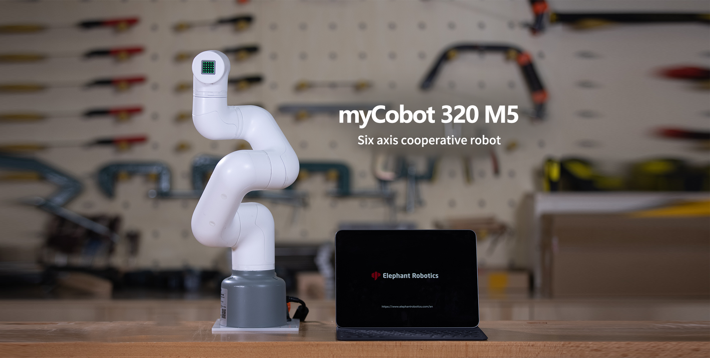

# myCobot 320

> 面向用户自主编程开发的六轴协作机器人

## gitbook-cn

- M5 版本：
  https://docs.elephantrobotics.com/docs/mycobot-320-m5-cn/
- Pi 版本：
  https://docs.elephantrobotics.com/docs/mycobot-320-pi-cn/

## gitbook-en

- M5 版本：
  https://docs.elephantrobotics.com/docs/mycobot-320-m5-en/
- Pi 版本：
  https://docs.elephantrobotics.com/docs/mycobot-320-pi-en/

## 产品图

- M5：  
  [产品画册](https://download-elephantrobotics.oss-cn-shenzhen.aliyuncs.com/Product_software/myCobot/%E4%BA%A7%E5%93%81%E7%94%BB%E5%86%8C/%E4%BA%A7%E5%93%81%E7%94%BB%E5%86%8Cmycobot320m5v20221013.pdf)
  

- Pi：  
  [产品画册](https://download-elephantrobotics.oss-cn-shenzhen.aliyuncs.com/Product_software/myCobot/%E4%BA%A7%E5%93%81%E7%94%BB%E5%86%8C/%E4%BA%A7%E5%93%81%E7%94%BB%E5%86%8CmyCobot320pi20221013.pdf)
  

## 产品简介

myCobot 320 机械臂由大象机器人公司开发，是专为教育、研究和轻工业自动化设计的协作机器人。这款机器人以其紧凑的设计和强大的功能而闻名，致力于为创新和学习提供无限可能。它的最大臂展为 350 毫米，最大有效载荷为 1 千克，支持不同难度的编程语言，适合各种技能水平的用户使用。  
机械臂支持 Python 语言，硬件接口包括 IO、USB 等，便于连接各种传感器和执行器。并且提供丰富的开放源代码库和 API，以简化开发流程，与 Windows、Linux 和 MacOS 兼容，适用于各种开发环境，鼓励用户参与扩展开发。

## 目录

- Pi：

  - [1 产品介绍](1-ProductIntroduction/README.md)
    - [1.1 设计理念](1-ProductIntroduction/1.1-DesignPhilosophy.md)
    - [1.2 适用人群](1-ProductIntroduction/1.2-SuitableUsers.md)
    - [1.3 应用场景](1-ProductIntroduction/1.3-ApplicationScenario.md)
    - [1.4 周边配件](1-ProductIntroduction/1.4-AccessoriesTools/README.md)
      - [1 自适应夹爪](1-ProductIntroduction/1.4-AccessoriesTools/1.4.1-Gripper/1-AdaptiveGripper.md)
      - [2 电动夹爪](1-ProductIntroduction/1.4-AccessoriesTools/1.4.1-Gripper/2-ElectricGripper.md)
      - [3 气动夹爪](1-ProductIntroduction/1.4-AccessoriesTools/1.4.1-Gripper/3-PneumaticGripper.md)
      - [4 柔性夹爪](1-ProductIntroduction/1.4-AccessoriesTools/1.4.1-Gripper/4-FlexibleGripper.md)
      - [5 吸盘模块](1-ProductIntroduction/1.4-AccessoriesTools/1.4.2-PumpCup/1-ModuleSuctionCup.md)
      - [6 摄像头模块](1-ProductIntroduction/1.4-AccessoriesTools/1.4.3-Camera/1-CameraModulePro.md)
      - [7 笔夹持器](1-ProductIntroduction/1.4-AccessoriesTools/1.4.4-Holder/1-PenHolderPro.md)
      - [8 手机夹持器](1-ProductIntroduction/1.4-AccessoriesTools/1.4.4-Holder/2-PhoneHolderPro.md)
  - [2 产品特性](2-ProductFeature/2.2_320_PI_product/README.md)
    - [2.1 机器规格参数](2-ProductFeature/2.2_320_PI_product/2.2.1-MachineSpecification.md)
    - [2.2 控制核心参数](2-ProductFeature/2.2_320_PI_product/2.2.2-ControlCoreParameter.md)
    - [2.3 机械结构参数](2-ProductFeature/2.2_320_PI_product/2.2.3-MechanicalStructureParameter.md)
    - [2.4 电气特性参数](2-ProductFeature/2.2_320_PI_product/2.2.4-ElectricalCharacteristicParameter.md)
    - [2.5 笛卡尔坐标系](2-ProductFeature/2.2_320_PI_product/2.2.5-CoordinateSystem.md)
  - [3 用户须知](3-UserNotes/320_PI/README.md)
    - [3.1 安全须知](3-UserNotes/320_PI/3.1.1-SafetyInstruction/1-SafetyInstruction.md)
    - [3.2 运输和储存](3-UserNotes/320_PI/3.1.2-TransportandStorage/1-TransportandStorage.md)
    - [3.3 维护和保养](3-UserNotes/320_PI/3.1.3-MaintenanceandCare/1-MaintenanceandCare.md)
    - [3.4 常见问题解决](3-UserNotes/320_PI/4-FAQ/3.2_320_PI_userNotes.md)
      - [1 如何优雅提问](3-UserNotes/320_PI/4-FAQ/0_how_to_ask.md)
      - [2 驱动相关](3-UserNotes/320_PI/4-FAQ/1_driver.md)
      - [3 软件](3-UserNotes/320_PI/4-FAQ/2_software.md)
      - [4 硬件](3-UserNotes/320_PI/4-FAQ/3_hardware.md)
  - [4 首次安装使用](4-FirstInstallAndUse/4.1-Pi/4.1_320_PI_firstUse.md)
    - [4.1 产品标准清单](4-FirstInstallAndUse/4.1-Pi/4.1.1-List.md)
    - [4.2 产品开箱指南](4-FirstInstallAndUse/4.1-Pi/4.1.2-UNbox.md)
    - [4.3 开机检测指南](4-FirstInstallAndUse/4.1-Pi/4.1.3-StartRobot/0_StartRobot.md)
      - [4.3.1 结构安装固定](4-FirstInstallAndUse/4.1-Pi/4.1.3-StartRobot/1_StructuralInstallation.md)
      - [4.3.2 外部线缆连接](4-FirstInstallAndUse/4.1-Pi/4.1.3-StartRobot/2_ExternalCableConnection.md)
      - [4.3.3 开机状态展示](4-FirstInstallAndUse/4.1-Pi/4.1.3-StartRobot/3_PowerOnStatusDisplay.md)
      - [4.3.4 基础功能检测](4-FirstInstallAndUse/4.1-Pi/4.1.3-StartRobot/4_BasicFunctionDetection.md)
  - [5 基础功能使用](5-BasicApplication/README_PI.md)
    - [5.1 系统使用说明](5-BasicApplication/5.1-SystemUsageInstructions/320pi/5.1-SystemUsageInstructions.md)
    - [5.2.1 软件使用说明-myblockly](5-BasicApplication/5.2-ApplicationUse/myblockly/320pi/README.md)
      - [1 准备工作](5-BasicApplication/5.2-ApplicationUse/myblockly/320pi/1-myBlocklyFirstUse.md)
      - [2 下载安装](5-BasicApplication/5.2-ApplicationUse/myblockly/320pi/2-install_uninstall.md)
      - [3 界面展示及功能使用](5-BasicApplication/5.2-ApplicationUse/myblockly/320pi/3-interface_description.md)
      - [4 控制 RGB 灯板](5-BasicApplication/5.2-ApplicationUse/myblockly/320pi/4-ControlRGB.md)
      - [5 控制机械臂回到原点](5-BasicApplication/5.2-ApplicationUse/myblockly/320pi/5-ControlRoboticArmBackZero.md)
      - [6 控制单关节运动](5-BasicApplication/5.2-ApplicationUse/myblockly/320pi/6-ControlSingleJoint.md)
      - [7 控制多关节运动](5-BasicApplication/5.2-ApplicationUse/myblockly/320pi/7-ControlSinglesJoint.md)
      - [8 夹爪使用](5-BasicApplication/5.2-ApplicationUse/myblockly/320pi/8-GripperUse.md)
      - [9 吸泵使用](5-BasicApplication/5.2-ApplicationUse/myblockly/320pi/9-PumpUse.md)
      - [10 常见问题解答](5-BasicApplication/5.2-ApplicationUse/myblockly/320pi/10-Q&A.md)
      - [11 API](5-BasicApplication/5.2-ApplicationUse/myblockly/320pi/11-api.md)
    - [5.2.2 软件使用说明-mystudio](5-BasicApplication/5.2-ApplicationUse/mystudio/320pi/README.md)
      - [1 环境搭建](5-BasicApplication/5.2-ApplicationUse/mystudio/320pi/1-setup.md)
      - [2 安装驱动](5-BasicApplication/5.2-ApplicationUse/mystudio/320pi/2-install_firmwares.md)
      - [3 烧录和更新固件](5-BasicApplication/5.2-ApplicationUse/mystudio/320pi/3-flash_firmwares.md)
      - [4 其他功能](5-BasicApplication/5.2-ApplicationUse/mystudio/320pi/4-other_function.md)
    - [5.3 固件更新说明](5-BasicApplication/5.3-FirmwareUse/pi/1-firmware.md)
  - [6 SDK 开发指南](6-SDKDevelopment/README.md)
    - [6.1 基于 python 开发使用](10-ApplicationBasePython/README.md)
      - [6.1.1 环境配置](10-ApplicationBasePython/10.1_320_PI-ApplicationPython/1_download.md)
      - [6.1.2 API 使用说明](10-ApplicationBasePython/10.1_320_PI-ApplicationPython/2_API.md)
      - [6.1.3 TCP/IP](10-ApplicationBasePython/10.1_320_PI-ApplicationPython/3_TCPIP.md)
      - [6.1.4 拖动示教](10-ApplicationBasePython/10.1_320_PI-ApplicationPython/4_drag.md)
      - [6.1.5 手柄控制](10-ApplicationBasePython/10.1_320_PI-ApplicationPython/5_Handle_control.md)
      - [6.1.6 使用案例](10-ApplicationBasePython/10.1_320_PI-ApplicationPython/6_example.md)
    - [6.2 基于 ROS1 开发使用](11-ApplicationBaseROS/11.1-ROS1/11.1.2-PI.md)
      - [6.2.1 环境搭建](11-ApplicationBaseROS/11.1-ROS1/11.1.2-320PI/11.1.2.1-环境搭建.md)
      - [6.2.2 ROS 基础](11-ApplicationBaseROS/11.1-ROS1/11.1.2-320PI/11.1.2.2-ROS基础.md)
      - [6.2.3 rviz 介绍](11-ApplicationBaseROS/11.1-ROS1/11.1.2-320PI/11.1.2.3-rviz介绍.md)
      - [6.2.4 基础功能](11-ApplicationBaseROS/11.1-ROS1/11.1.2-320PI/11.1.2.4-基础功能.md)
    - [6.3 基于 ROS2 开发使用](11-ApplicationBaseROS/11.2-ROS2/11.2.2-PI.md)
      - [6.3.1 环境搭建](11-ApplicationBaseROS/11.2-ROS2/11.2.2-320PI/11.2.2.1-环境搭建.md)
      - [6.3.2 ROS2 基础](11-ApplicationBaseROS/11.2-ROS2/11.2.2-320PI/11.2.2.2-ROS2基础.md)
      - [6.3.3 rviz2 介绍](11-ApplicationBaseROS/11.2-ROS2/11.2.2-320PI/11.2.2.3-rviz2介绍.md)
      - [6.3.4 基础功能](11-ApplicationBaseROS/11.2-ROS2/11.2.2-320PI/11.2.2.4-基础功能.md)
    - [6.4 串口通信](6-SDKDevelopment/6.1-CommunicationDoc.md)
  - [7 机械臂使用场景案例](7-ExamplesRobotsUsing/README.md)
  - [8 相关资料下载](8-FilesDownload/README.md)
    - [8.1 产品资料](8-FilesDownload/8.1_320_PI_Files/8.1_files.md)
    - [8.2 产品图纸](8-FilesDownload/8.1_320_PI_Files/8.2_productBrochure.md)
    - [8.3 软件资料及源码](8-FilesDownload/8.1_320_PI_Files/8.3_softwareSource.md)
    - [8.4 系统资料](8-FilesDownload/8.1_320_PI_Files/8.4_systemInfo.md)
    - [8.5 宣传资料](8-FilesDownload/8.1_320_PI_Files/8.5_PublicityMaterial.md)
  - [9 关于我们](9-AboutUs/README.md)
    - [9.1 大象机器人](9-AboutUs/9.1_company.md)
    - [9.2 联系我们](9-AboutUs/9.2_contact.md)
